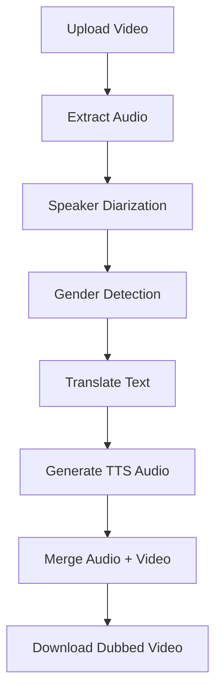

# 🎙️ EduDub — Real-Time Multilingual Educational Content Dubbing

EduDub is an **AI-powered, real-time multilingual educational content dubbing platform** built with **FastAPI**, **Murf APIs**, **ElevenLabs TTS**, and **speaker diarization**.  
It enables **automatic language detection**, **gender-based voice assignment**, **lip-sync-friendly dubbing**, and **subtitling** for educational videos.

---

## Features

- ** Real-Time Dubbing** — Generate dubbed audio instantly using ElevenLabs or Murf APIs.
- ** Gender-Specific Voice Matching** — Assign male or female voices based on speaker diarization.
- ** Multilingual Support** — Auto-detect source language & translate to any target language.
- ** Auto-Subtitles** — Generate captions for accessibility.
- ** Lip-Sync Friendly** — Voices are generated to align closely with original video timing.
- ** Fast Processing** — Optimized for minimal delay in live educational scenarios.

---

##  Tech Stack

| Component            | Technology Used |
|----------------------|-----------------|
| **Backend**          | FastAPI         |
| **TTS & Dubbing**    | ElevenLabs API, Murf API |
| **Speaker Diarization** | Pyannote.audio |
| **Audio Processing** | Torchaudio, FFmpeg |
| **Frontend**         | HTML, CSS, JavaScript |
| **Embedding & Gender Detection** | NumPy, Cosine Similarity |

---

##  Project Structure

```
EduDub/
│── backend/
│   ├── main.py                # FastAPI entry point
│   ├── murf_client.py         # Murf API integration
│   ├── elevenlabs_client.py   # ElevenLabs TTS integration
│   ├── whisper_translate.py   # Speech-to-text + translation
│   ├── diarization.py         # Speaker diarization + gender detection
│   └── utils.py               # Helper functions
│
│── frontend/
│   ├── index.html             # Upload & dubbing UI
│   ├── style.css              # Modern UI styling
│   ├── script.js              # API calls & video handling
│
│── README.md
│── requirements.txt           # Python dependencies
│── .env              # API keys & settings
```

---

##  Installation

1️⃣ **Clone the repository**
```bash
git clone https://github.com/your-username/EduDub.git
cd EduDub
```

2️⃣ **Create a virtual environment & install dependencies**
```bash
python -m venv venv
source venv/bin/activate   # On Mac/Linux
venv\Scripts\activate    # On Windows

pip install -r requirements.txt
```

3️⃣ **Set up API keys in `.env`**
```yaml
murf_api_key: "YOUR_MURF_API_KEY"
Hf_token: "HF_TOKEN"
elevenlabs_api_key: "YOUR_ELEVENLABS_API_KEY"
```

4️⃣ **Run the backend**
```bash
uvicorn backend.main:app --reload
```

5️⃣ **Open `frontend/index.html` in your browser**

---

##  Usage

1. Upload an educational video.
2. Select target language & dubbing style.
3. EduDub automatically:
   - Extracts audio
   - Performs speaker diarization
   - Assigns gender-specific voices
   - Translates & generates dubbed audio
   - Merges dubbed audio with the original video
4. Download your final dubbed video.

---

##  Workflow Diagram



---

##  License
MIT License — feel free to modify and use.

---

## 👨‍💻 Author
**Yash Malviya**  
AI & MLOps Developer | Speech & Video AI Specialist
